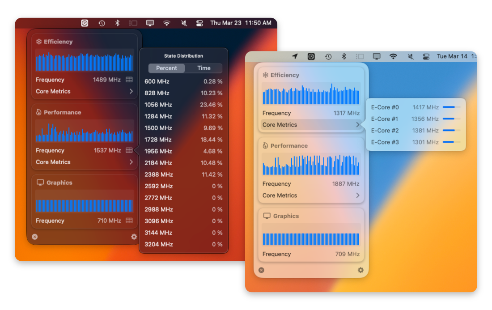

<!--   
 -->
<!--      -->
    <h2 align="center" style="">Frequency Stats - for Apple Silicon</h2>
<!--     
 -->
    

    <b>Daemonless</b> and <b>kextless</b> CPU and GPU frequency stats in your menubar!
    

    
    
    
      
          
        <a href="https://github.com/BitesPotatoBacks/FrequencyStats/releases">Download from Github Releases</a>
    <!--
    
-->

## Project Deets
Once upon a time, I created a command line tool, the [SocPowerBuddy](https://github.com/BitesPotatoBacks/SocPowerBuddy); the soul purpose of which was to provide _real_ per-core frequency metrics on Apple Silicon without needing sudo. I thought that it would be cool to make an efficient little menu bar app based on it, which doesn't need a daemon or a kext!

I hope to add Intel support someday, but to follow my personal rule for this project, it needs to be a rootless implementation...

### Features
The current feature set covers cluster frequencies and state distribution, per-core frequencies with colorized meters (for CPUs), and colorized per-cluster graphs (that I need to expand on)...

### WIP Features
- [ ] Extended scrollable history for graphs
- [ ] CSV Dumping
- [ ] Menubar Widgets

## Installation
You can download the latest version from the [Github Releases.](https://github.com/BitesPotatoBacks/FrequencyStats/releases)

## System Requirements
- Apple Silicon
- MacOS Big Sur (macOS 11) or newer

Full compatibility notes for silicon support can be found [here.](https://github.com/BitesPotatoBacks/SocPowerBuddy#compatibility-notes)

## Supported Languages
If you can call it that, for what little there is lol...
- English
- Italian
- Japanese
- Korean
- Portuguese
- Russian
- Chinese (Simplified, Traditional)
- Vietnamese
- Dutch
- Spanish
- French
- German

## Contribution
If you find any bugs or wish to add any features, open an issue or PR and i'll get my eyes on it as soon as possible!

## License
[MIT License](https://github.com/BitesPotatoBacks/FrequencyStats/blob/main/LICENSE)

