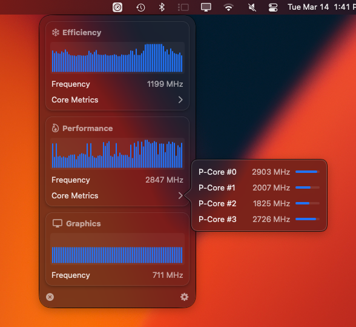
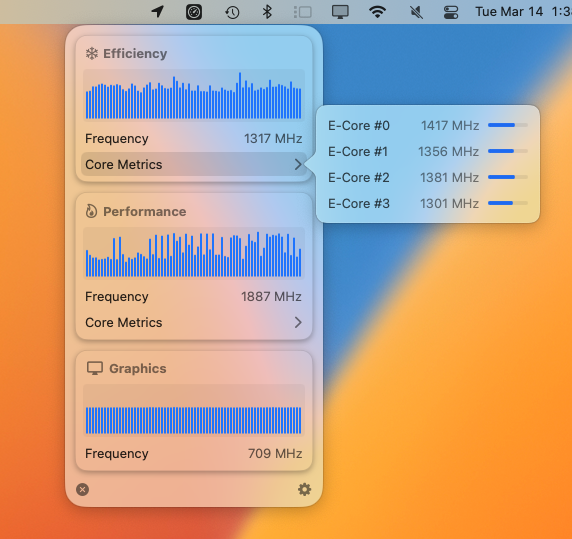

<!--   
 -->
<!--      -->
    <h1 align="center" style="">Frequency Stats</h1>
<!--     
 -->
    

    Daemonless CPU and GPU Frequency Stats in your Menu Bar, for Apple Silicon!
    

    
    
    
      
    

___

# Deets
Once upon a time, I created a command line tool, the [SocPowerBuddy](https://github.com/BitesPotatoBacks/SocPowerBuddy), the soul purpose of which was to provide _real_ per-core frequency metrics on Apple Silicon without needing sudo. I thought that it would be cool to make an efficient little menu bar app based on it!

I hope to add Intel support someday, but to follow my personal rule for this project, it needs to be a rootless implementation...

# Installation
You can download the latest version [here!](https://github.com/BitesPotatoBacks/FrequencyStats/releases)

# Requirements
For Now, you'll need an Apple Silicon machine running Big Sur (macOS 11) or newer to use this app. 

___

# WIP Features
- [x] ~~Cluster Frequencies~~
- [x] ~~Cluster Graphs~~
- [x] ~~Per-Core Frequencies~~
- [x] ~~Per-Core Meters~~
- [x] ~~Inerval Setting (1-10s)~~
- [ ] Cluster Graphs extended scrollable history
- [ ] DVFM/P-State distribution popover
- [ ] Graph color options
- [ ] CSV Dumping
- [ ] Menubar Widgets

## Supported Languages
If you can call it that, for what little there is lol...
- English
- Italian
- Japanese
- Korean
- Portuguese
- Russian
- Chinese (Simplified, Traditional)
- Vietnamese
- Dutch
- Spanish
- French
- German
